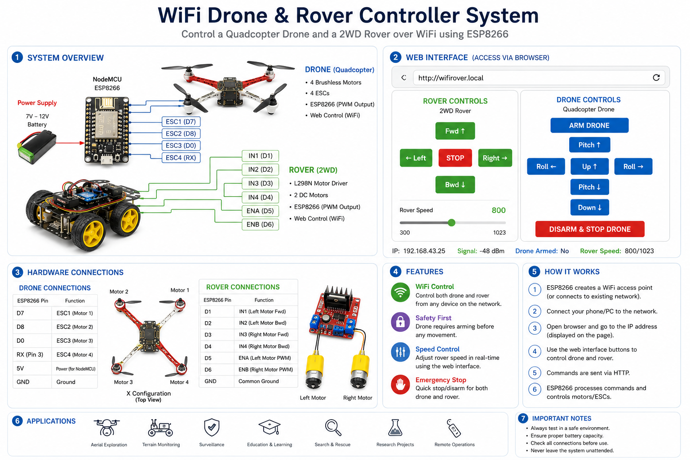

# wireless_drone_rover_system
# ESP8266 Drone and Rover Control System

## Overview

<p align="center">
  
</p>

The ESP8266 Drone and Rover Control System is an IoT-based web-controlled robotics platform designed to manage both a ground rover and a quadcopter drone through a single web interface. The system utilizes the ESP8266 Wi-Fi module as the central controller, allowing users to send commands from any device connected to the same network.

The platform provides:

* Wireless rover control
* Wireless drone command interface
* Real-time web dashboard
* HTTP-based communication
* Speed control management
* Integrated command routing
* Browser-based operation

---


The system follows a client-server architecture where the frontend web application sends HTTP requests to the ESP8266 backend. The ESP8266 processes the commands and routes them to the appropriate subsystem.

### Workflow

1. User accesses the web dashboard.
2. User clicks a control button.
3. Browser sends an HTTP request.
4. ESP8266 receives the request.
5. Request is processed.
6. Corresponding subsystem receives instructions.
7. Response is returned to the frontend.

---

## Frontend Dashboard

<p align="center">
  
</p>

The frontend dashboard contains two independent control sections:

### Rover Controls

* Forward
* Backward
* Left
* Right
* Stop
* Speed Adjustment

### Drone Controls

* Arm
* Increase Throttle
* Decrease Throttle
* Roll Left
* Roll Right
* Pitch Forward
* Pitch Backward
* Stop and Disarm

---

## Communication Flow

<p align="center">
  
</p>

The communication process is based on HTTP requests.

### Example Requests

```http
GET /forward
GET /backward
GET /left
GET /right
GET /stop
```

### Drone Requests

```http
GET /drone/arm
GET /drone/up
GET /drone/down
GET /drone/pitch_fwd
GET /drone/pitch_bwd
GET /drone/roll_left
GET /drone/roll_right
GET /drone/stop
```

### Speed Request

```http
GET /speed?value=800
```

---

## Hardware Components

### Controller

* ESP8266 NodeMCU

### Rover Components

* L298N Motor Driver
* DC Gear Motors
* Chassis
* Wheels
* Battery Pack

### Drone Components

* Quadcopter Frame
* Brushless Motors
* Electronic Speed Controllers (ESCs)
* LiPo Battery

---

## Backend Features

### Web Server

The ESP8266 hosts an HTTP server that handles incoming requests and executes corresponding control functions.

### Route Handling

The backend includes:

* Rover command routes
* Drone command routes
* Speed control routes
* Status monitoring routes

### Wi-Fi Connectivity

The controller automatically connects to a configured Wi-Fi network and hosts the dashboard interface.

---

## Project Structure

```text
ESP8266-Drone-Rover-Control-System
│
├── firmware
│   ├── main.ino
│   
│
├── images
│   ├── banner.png
│   ├── system_architecture.png
│   ├── frontend_dashboard.png
│   └── request_flow.png
│
└── README.md
```

---

## User Interface


The user interface is designed to be responsive and accessible from:

* Mobile Phones
* Tablets
* Laptops
* Desktop Computers

The interface communicates directly with the ESP8266 web server using asynchronous HTTP requests.

---

## Advantages

* Wireless operation
* Browser-based control
* Low-cost implementation
* Modular architecture
* Expandable design
* Easy deployment
* Real-time response

---

## Future Enhancements

Potential future improvements include:

* Live telemetry monitoring
* Sensor integration
* GPS visualization
* Camera streaming
* Data logging
* Mobile application
* Cloud connectivity
* MQTT support

---

## Installation

### Clone Repository

```bash
git clone https://github.com/your-username/ESP8266-Drone-Rover-Control-System.git
```

### Open Project

```bash
Arduino IDE
```

### Install Required Libraries

* ESP8266WiFi
* ESP8266WebServer
* ESP8266mDNS
* Servo

### Upload Firmware

1. Connect ESP8266.
2. Select correct board.
3. Select COM port.
4. Upload firmware.

---

## Status Endpoint

```http
GET /status
```

Example Response:

```json
{
  "ip": "192.168.1.100",
  "signal": "-45 dBm",
  "rover_speed": 800,
  "drone_armed": true
}
```

---

## License

This project is intended for educational and research purposes.

---

## Author

Malay Maity

Full Stack Developer | Embedded Systems Enthusiast | IoT Developer
